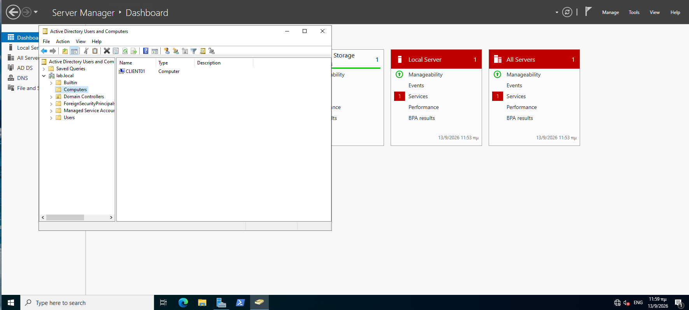
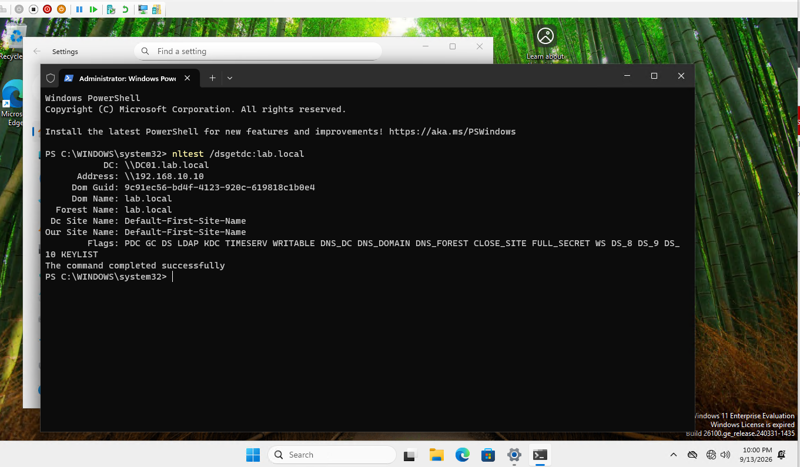

Lab 2 — Domain controller lab.local and first domain-joined client

Date: 11–13 September 2026 Goal: Build the first domain controller with integrated DNS, then join a Windows 11 workstation to the domain.

Environment
Host: Windows 11 with Hyper-V, 32 GB RAM, Internal virtual switch LAB
DC01 — Windows Server 2022 Standard (Desktop Experience), 4 GB RAM, 80 GB disk IPv4 192.168.10.10/24, gateway 192.168.10.1, DNS 127.0.0.1
CLIENT01 — Windows 11 Enterprise, 4 GB RAM, 80 GB disk IPv4 192.168.10.50/24, gateway 192.168.10.1, DNS 192.168.10.10
Steps
A. Domain controller
Server Manager → Manage → Add Roles and Features → Active Directory Domain Services → Install.
Yellow notification flag → Promote this server to a domain controller.
Add a new forest → Root domain name lab.local.
Left functional levels at their defaults, kept DNS server selected, set the DSRM password.
Install. The server reboots on its own.
Signed in as LAB\Administrator → Server Manager → Tools → Active Directory Users and Computers: lab.local is listed with its default containers.
B. The client
New VM CLIENT01: Generation 2, 4 GB RAM, 80 GB disk, switch LAB, Windows 11 ISO.
Settings → Security → Enable Trusted Platform Module before first boot. Without it Windows 11 setup stops at the requirements check.
During setup: Sign-in options → Domain join instead, to create a local account instead of signing in with a Microsoft account.
Network: IP 192.168.10.50, mask 255.255.255.0, gateway 192.168.10.1, DNS 192.168.10.10. DNS is the critical setting — without it the domain cannot be located.
sysdm.cpl → Change → Member of Domain → lab.local → credentials of LAB\Administrator → reboot.
Verification

From CLIENT01:

nltest /dsgetdc:lab.local

DC: \\DC01.lab.local
Address: \\192.168.10.10
Dom Name: lab.local
Forest Name: lab.local
Flags: PDC GC DS LDAP KDC TIMESERV WRITABLE DNS_DC DNS_DOMAIN DNS_FOREST ...
The command completed successfully

Additional checks:

whoami                        -> lab\administrator
ipconfig /all                 -> Host Name CLIENT01, Primary Dns Suffix lab.local
dcdiag /q                     (on DC01) -> no output means healthy
What went wrong

1. Wrong IP address on the domain controller. I had given DC01 the address 192.168.10.50 — the one meant for the client. ping 192.168.10.10 returned Destination host unreachable from the machine's own address, meaning nothing existed at the address I was asking for, rather than a packet being lost in transit. Fix: ncpa.cpl → IPv4 → 192.168.10.10, DNS 127.0.0.1.

2. The DC's DNS records still pointed at the old address. After the change, dcdiag reported registration failures for every SRV record and for the DC's GUID CNAME. The fix is not to recreate records by hand, but to have the service that owns them register again:

nltest /dsregdns
net stop netlogon
net start netlogon

3. The errors I was chasing were already fixed. dcdiag reads the System event log and reports old entries too. All of them carried the same timestamp, from the window when the machine was still misconfigured. Rule: read the timestamp before chasing the error.

4. Windows 11 refused to install — "The PC must support TPM 2.0". Generation 2 Hyper-V VMs do provide a virtual TPM, but it is disabled by default. Settings → Security → Enable Trusted Platform Module, with the VM powered off.

5. Renaming the computer and joining the domain in one step. I did both in the same dialog. The join succeeded, but was immediately followed by "Changing the Primary Domain DNS name … failed", because a rename does not take effect until the machine reboots. Everything was correct after the restart. Rule: rename first, reboot, then join the domain.

What I took away
Active Directory does not work without DNS: a client locates the domain controller by querying DNS for SRV records. That is why the client points at the DC and not at the router.
Destination host unreachable means no recipient was found on the local network. Request timed out means the packet left but no answer came back. Different diagnosis, different fix.
Take a checkpoint before any change that can break something. Changing the IP address of a domain controller is exactly that kind of change.
